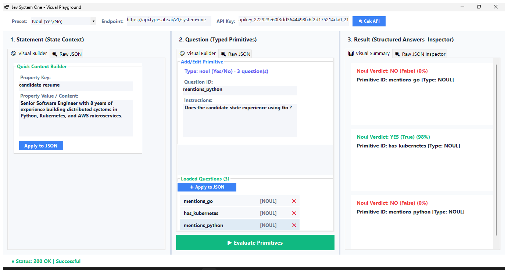

# Jev System One - Visual Playground

A WinForms (.NET 10) desktop playground for **Jev**, TypeSafe's flagship System One model. It evaluates *typed questions* (Choice, Score, Noul) against a *state* document and renders the **structured answers** back — visually, and as raw JSON for inspection.

> Jev evaluates questions in **parallel**, one request → one structured response. No text generation, no parsing. See <https://docs.typesafe.ai>.

## Primitives

Jev exposes three AI primitives. Each question has an ID, a `type`, and `instructions`; Choice and Score also take `criteria`.

| Type | Asks | Returns |
| --- | --- | --- |
| **Choice** | Which of these options? | `choice`, `probabilities`, `confidence` |
| **Score** | Which level on a rubric? | `score`, `legend`, `probabilities`, `confidence` |
| **Noul** | Is this statement true? | `noul` (0–1, no separate confidence) |

Multiple questions — even mixed types — can be sent together in one request and are evaluated independently against the same state.

## Features

- **3-pane balanced layout**: Statement, Question, Result. Splitters stay balanced on resize.
- **Visual builders** for Statement (key + content) and Question (ID, instructions, options/criteria) with live JSON generation.
- **Preset scenarios** (header dropdown): Choice (Routing), Score (Rubric), Noul (Yes/No) — one click loads a realistic state + question set.
- **Loaded Questions** list: every question in the JSON is shown; click to edit, ✕ to delete, Add dynamic (empty ID → auto `q{n}`, duplicate → `_2`, `_3`, …).
- **Result rendering**: visual summary cards per answer plus a raw JSON inspector.
- **"Cek API"** check, editable endpoint & API key.
- **Light theme** with flat controls, no borders, modern spacing.
- **GitHub Pages** documentation site (classic retro theme): <https://adyoi.github.io/jev-system-one-playground/> (source in [`docs/`](docs/index.html)).

## Screenshot



## Requirements

- [.NET SDK 10.0.x](https://dotnet.microsoft.com/download) (built against `net10.0-windows`)
- Windows 10/11

## Build & Run

```powershell
dotnet build
Start-Process .\bin\Debug\net10.0-windows\JevSystemOnePlayground.exe
```

Or simply:

```powershell
dotnet run
```

## Usage

1. Pick a **Preset** (Choice/Score/Noul) or edit the raw JSON in the Statement and Question panes.
2. Optionally use the **Visual Builder** tabs to compose a single state field or question without touching JSON.
3. Click **▶ Evaluate Primitives**.
4. Inspect results in **Visual Summary** and **Raw JSON Inspector**. Tabs: Statement → `🔍 Raw JSON`, Question → `🔍 Raw JSON`, Result → `🔍 Raw JSON Inspector`.

### Question JSON shape

```json
{
  "mentions_python": {
    "type": "noul",
    "instructions": "Does the candidate state experience using Python?"
  },
  "route_intent": {
    "type": "choice",
    "instructions": "Which department should this request be routed to?",
    "criteria": {
      "billing": "Refund and payment issues",
      "shipping": "Delivery and logistics issues"
    }
  },
  "severity_score": {
    "type": "score",
    "instructions": "Rate the severity of the incident.",
    "criteria": ["low", "medium", "high", "critical"]
  }
}
```

### Answer JSON shape

```json
{
  "model": "jev-system-one-v1",
  "status": "200 OK",
  "answers": {
    "mentions_python": { "type": "noul", "noul": 0.98 },
    "route_intent": { "type": "choice", "choice": "billing", "probabilities": { "billing": 0.92 }, "confidence": 0.92 },
    "severity_score": { "type": "score", "score": 8.0, "legend": { "1": "low" }, "probabilities": { }, "confidence": 0.93 }
  }
}
```

## Great to know

- **This build runs in sandbox/simulation mode.** The endpoint `https://api.typesafe.ai/v1/system-one` is not currently reachable from this build (returns `Not Found`), so evaluation uses a local keyword/token matcher over the state's *values* (keys are excluded from matching, so e.g. a question about "Go" correctly returns NO when the resume only mentions Python). Wire the real HTTP call and parse the typed answers to go live.

## Project structure

```
Test/
├── Program.cs          # Single-file WinForms app (UI + builders + evaluator)
├── JevSystemOnePlayground.csproj # net10.0-windows, WinExe, Windows Forms
├── Properties/
│   ├── launchSettings.json      # "JevSystemOnePlayground" project launch profile
│   └── PublishProfiles/         # win-x64 / win-x86 / win-arm64 (single-file ready)
└── README.md
```

## Publishing

Self-contained per-architecture publish profiles are included:

```powershell
dotnet publish -c Release -p:PublishProfile=win-x64
```

## Known limitations / next steps

- Evaluation is simulated (see above); real API wiring + typed response parsing are the main next step.
- UI is a single file; consider splitting into panes, evaluator, and theme modules as it grows.
- API key is pre-filled as a default; prefer storing user settings outside the build and protecting with DPAPI.
- No persistence of custom presets yet.